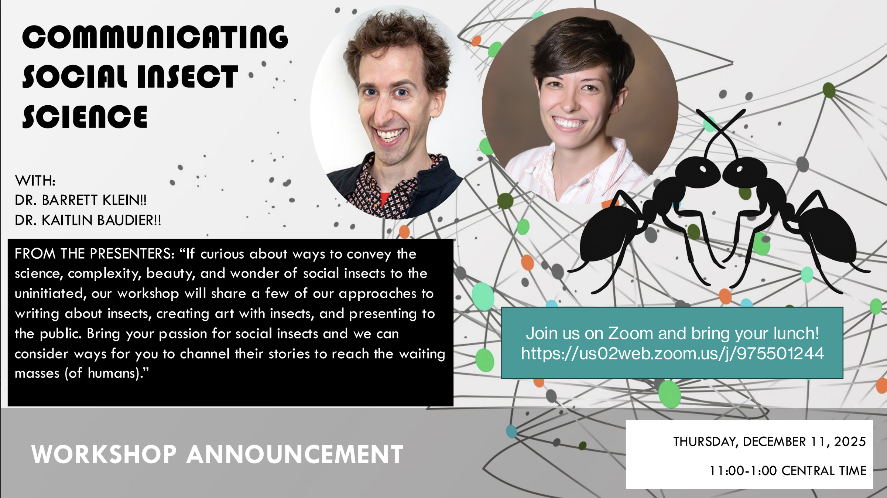

Tips and tools for sharing our love of social insects with the world.

{width=25% fig-align="center" .lightbox}

The IUSSI-NAS DEIJ Committee is excited to announce __our second workshop__.

Topic:      __COMMUNICATING SOCIAL INSECT SCIENCE__ \
Presenters: __DR. BARRETT KLEIN and DR. KAITLIN BAUDIER__ \
Where:      __Hosted on Zoom__ \

The workshop will be December 11, 2025 from 11-1pm central time, via Zoom. We will have presentations and lots of discussion. What better way to spend your lunch hour than with your social insect peeps talking about sharing our love of social insects with the world?!?!

### Recording of workshop


